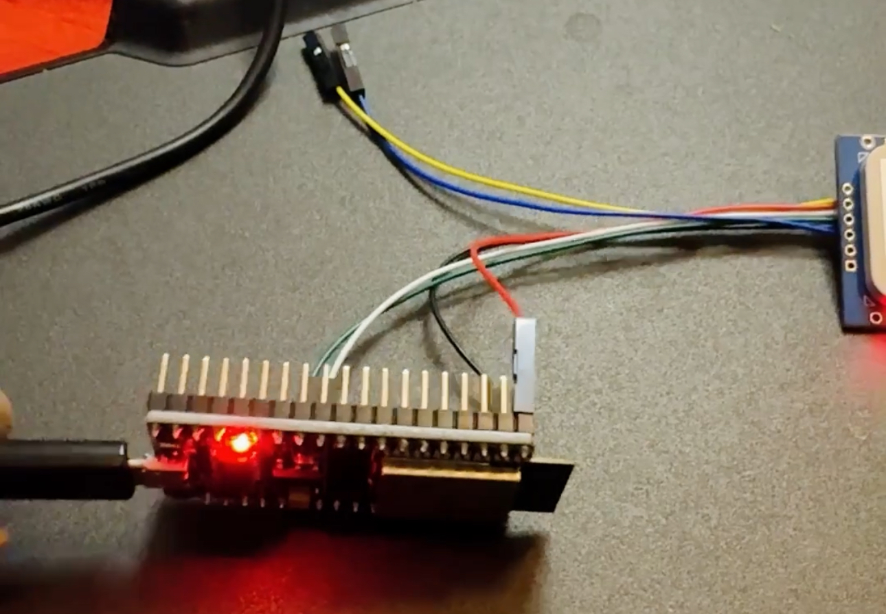
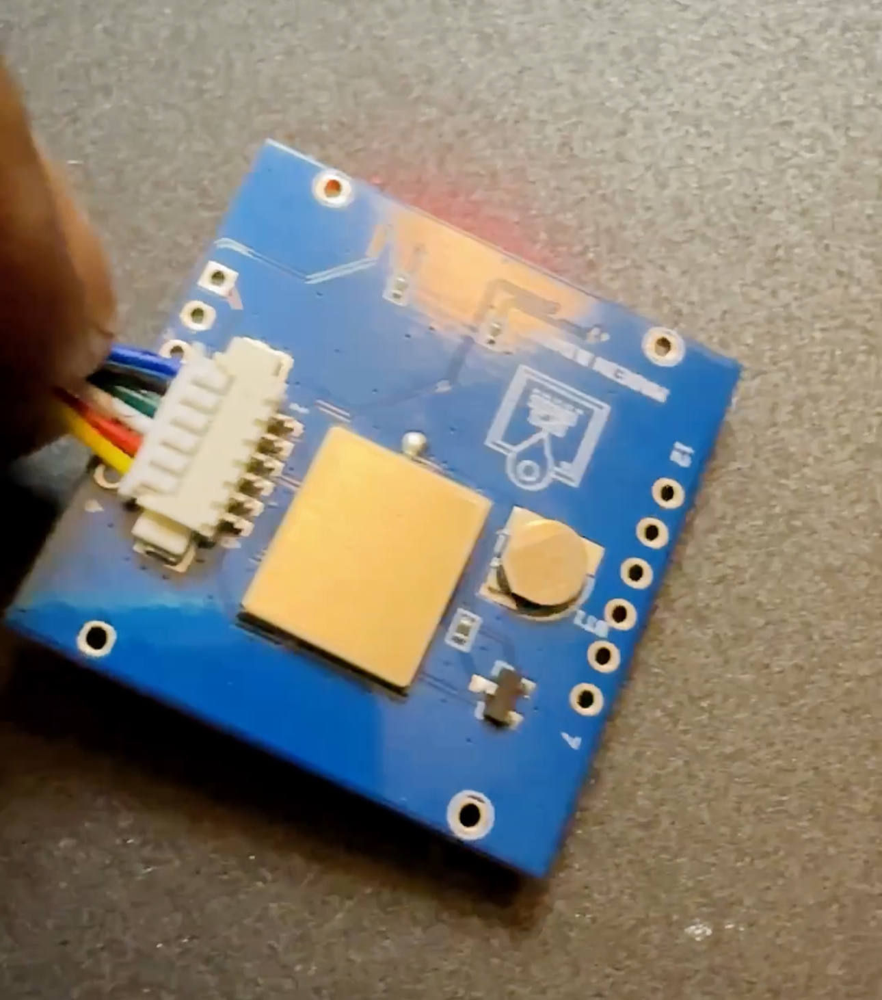
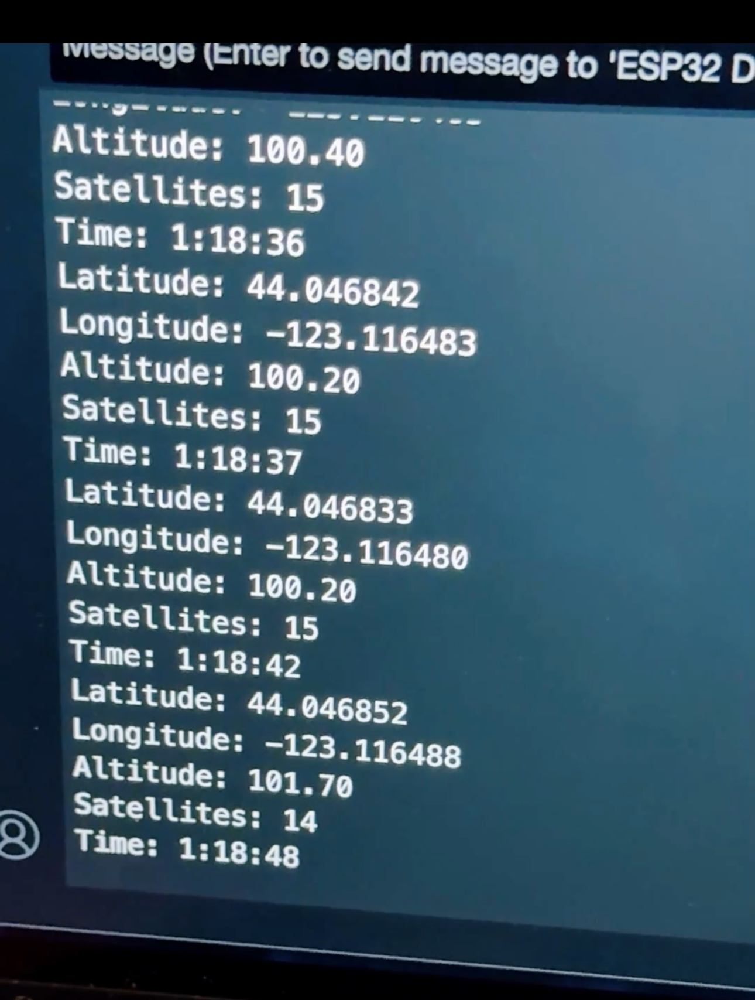
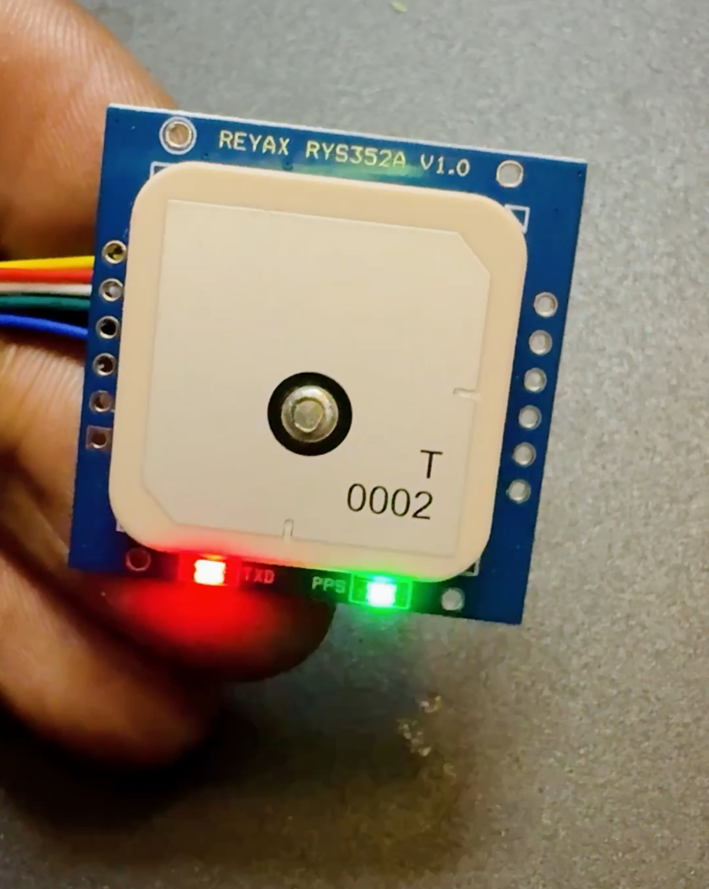

# ESP32 GPS Tracker
Generate GPS data w/ ESP32 &amp; Reyax RYS352A GPS/GNSS module!

## Description

This project is a comprehensive GPS tracking system using an ESP32 microcontroller and a Reyax RYS352A GPS/GNSS module. The system is designed to present GPS data in the serial terminal.

## Features

- **GPS Integration**: Retrieves and displays latitude, longitude, altitude, and satellite count.
- **Real-Time Clock (RTC)**: Synchronizes with GPS time for accurate timestamping.
- **Serial Output**: Prints scan results and status messages to the serial monitor for debugging and real-time monitoring.

## Components

- **ESP32**: Microcontroller with integrated WiFi and Bluetooth.
- **Reyax RYS352A GPS Module**: For acquiring GPS data (latitude, longitude, altitude, etc.).
Amazon store: https://www.amazon.com/dp/B0CM5JTJL7
Digikey store: https://www.digikey.com/en/products/detail/reyax/RYS352A/22206992
REYAX website: https://reyax.com/products/RYS352A
Distributor Lemos International: https://lemosint.com/
Distributor Micro Technology: https://mtgelectronics.com

## How It Works

1. **Initialization**: Sets up serial communication, initializes the GPS module, OLED display, SD card, and RTC.
2. **GPS Data Handling**: Continuously reads GPS data and updates the RTC.
4. **Data Display**: Shows GPS data in serial terminal.

## Usage

1. **Setup**: Connect the components as per the wiring diagram and upload the code to the ESP32.
2. **Operation**: Power on the device. The system will display GPS data on the OLED screen and log WiFi networks every 15 seconds.

## Contribution

I welcome contributions from the community! Feel free to fork the repository, submit issues, and create pull requests to improve the functionality and performance of this project.
